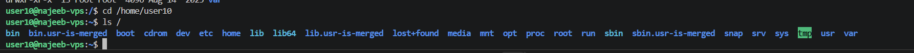
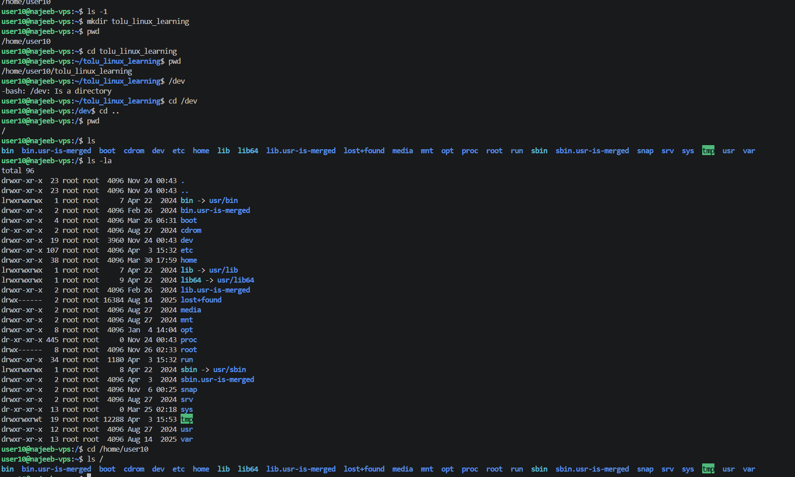

# Day 02 - [Topic]

## Objective

What was the goal for today?

Learn Linux basic command
Linux file system

## What I Learned

some of the must know linux commands are 
- ls — List files in a directory
- cd — Change directory
- pwd — Show current directory
- cat — View file content
- mkdir — Create a new folder
- rm — Delete files or folders
- cp — Copy files or directories
- mv — Move or rename files
- grep — Search inside files
- echo — Print text or variable
- touch — to create empty file
- touch file1 file2 file3 — cretaing multpile empty files at once 
nano  -- this is to open a simple text editor
vim or Vi -- to open a powerful text editor 
tail -n 10-- to show the last 10 lines of a file
head -n 10 to show the first 10 lines

- Linux file system is how  Linux organizes all files and folders.
It starts from / which is the root folder and everything else branches from it .
## /etc — Configuration files
System settings live here
Contains config files for apps and services
## /bin — Essential commands
Basic commands like:ls, cd
these are required for the system to run
## /usr — Installed programs
Contains most applications and libraries 
Like “Program Files” in Windows
## /var — Logs & changing data
Logs, cache, temp data
this is useful for debugging e
## /root — Admin (superuser) home
Home folder for the root use
## /tmp — Temporary files
Files that can be deleted anytime
## /tmp — Temporary files
Files that can be deleted anytime
## /sbin — System binaries
requires admin privilege/root access

---

## What I Built / Practiced

- i was able to navigate the through the various directories  and also view hidde  folders/files 
- 

---

## Challenges Faced

- 
- 

---

## Key Takeaways

- 
- 

---

## Resources

- 

---

## Output

